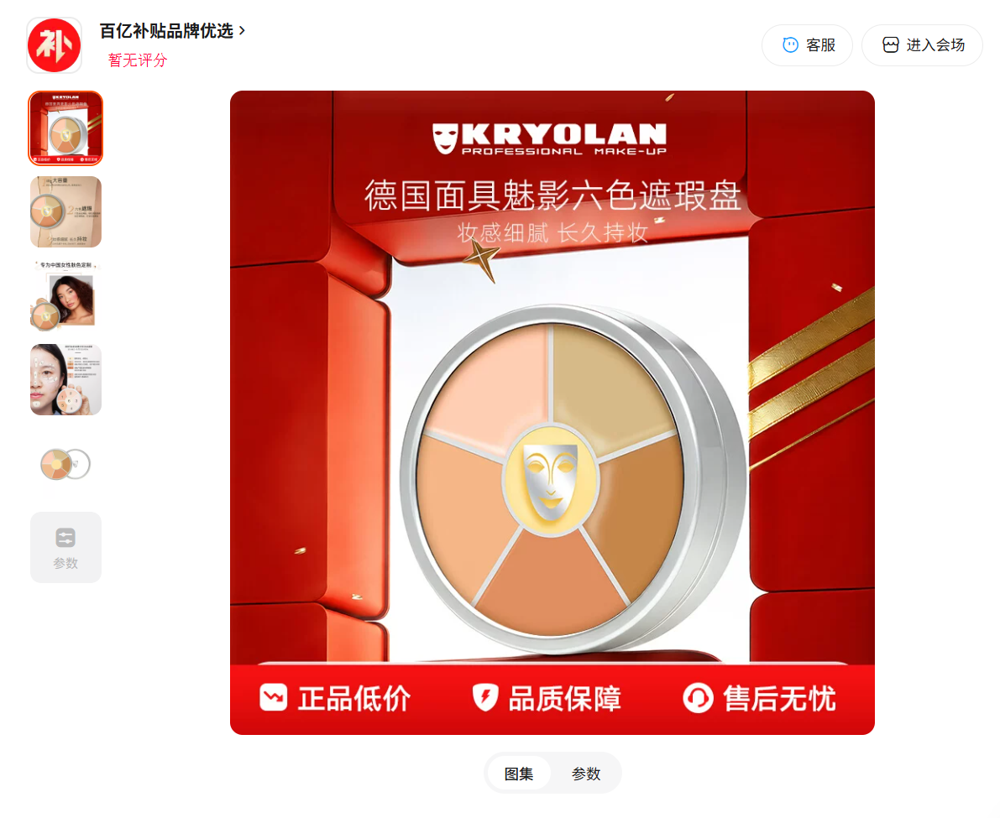

# KRYOLAN 三色/六色遮瑕盘

> 这是社区成员提供的个人消费体验，不是广告、医学建议或固定遮盖效果保证。商品链接、价格和商业关系仍需补充核对。

## 商品页面截图（必填）

截图显示为 KRYOLAN 德国面具魅影六色遮瑕盘，可作为后续搜索同款和核对规格的线索；投稿者补充三色盘也有相同用途。截图中没有账号、地址或订单号等个人信息。

## 怎么消费或使用（必填）

投稿者本人实际使用这款遮瑕盘处理胡青，反馈遮盖效果非常好。其使用顺序是先用遮瑕按需覆盖胡青，再上粉底液；投稿者表示一盘可以使用好几年，三色盘也一样适用。具体色号、上妆工具和持妆时间尚未提供，因此本记录不把个人体验扩写成固定化妆步骤。

## 推荐理由（必填）

对投稿者而言，它对遮住胡青很有效，三色盘和六色盘都能满足使用需求，且单盘消耗慢、使用周期长。这里的“非常好用”和“可以用好几年”都是投稿者的主观体验，不代表所有肤色、胡青程度或皮肤状态都会得到相同结果。

## 地区与价格

- 购买渠道：待投稿者补充
- 实付价格：约 200 元（投稿者估计，具体规格和渠道待核对）
- 商品链接：待投稿者补充完整 HTTPS 页面

## 缺点与不适合谁（必填）

目前缺少具体色号、质地、持妆时间、卸妆难度和商品链接。建议少量多次叠加，按需遮住胡青后再上粉底；敏感或破损皮肤不适合直接大面积使用。

## 安全、材质与清洁

首次使用先在小范围测试，上妆工具保持清洁并及时卸妆；出现刺痛、红肿、瘙痒或皮疹就停止使用。

## 商业关系（必填）

投稿者尚未说明是否自费购买，或与卖家、品牌、制造商、服务提供方存在赠品、赞助、联盟或从业关系；在确认前不视为无商业关系推荐。

## 投稿前确认（必填）

- [x] 投稿者说明本人实际购买并使用过该商品。
- [x] 已提供商品页面截图，并未包含可识别个人信息。
- [ ] 已披露赠品、赞助、联盟、卖家、制造商或服务提供方关系。
- [x] 记录没有包含处方药、危险器具、医学治疗承诺或固定效果保证。
