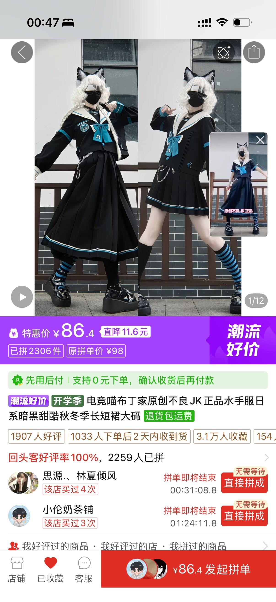

# 黑色/藏青色水手服

> 这是社区成员的个人购买和穿着体验，不是广告、医学建议或效果保证。

## 链接与商品页面截图（至少一项）

商品页面截图：

本次投稿未提供可长期访问的商品链接；以截图中的商品页面信息为准。

## 怎么消费或使用（必填）

本人实际购买并穿着过黑色/藏青色水手服，搭配百褶裙使用。适合在家中进行低压力的首次女装尝试；穿着前应按商家尺码表确认胸围、腰围、肩宽和裙长。

## 推荐理由（必填）

对本人而言，较大的海军领能够在视觉上遮挡部分肩宽和肩部轮廓，配合百褶裙后比较容易形成完整造型。黑色或藏青色的配色相对低调，适合在家中先熟悉女装穿着感受。

以上是个人体型和穿着体验，不代表对所有人都有相同的遮挡效果；领型、面料挺度、尺码和肩部剪裁都会影响实际效果。

## 地区与价格

- 购买渠道：截图所示电商平台
- 截图显示特惠价：86.4 元
- 截图显示原拼单价：98 元
- 实际价格可能因活动、尺码和运费变化，购买前请重新确认

## 缺点与不适合谁（必填）

水手服和百褶裙的版型可能需要搭配合适的尺码；过紧的领口、袖口或腰部会影响活动舒适度。较大的海军领只能改变视觉轮廓，不能真正改变肩宽。需要长时间活动、骑行或进行剧烈运动时，应先确认裙装长度和活动限制。

## 安全、材质与清洁

按商品标签进行清洗和晾晒，首次穿着先检查领口、腰部和拉链等位置是否摩擦皮肤。出现持续瘙痒、红疹、麻木或明显压迫感时应脱下并停止穿着。

## 商业关系（必填）

本人自费购买，与卖家、制造商或店面无商业关系。
