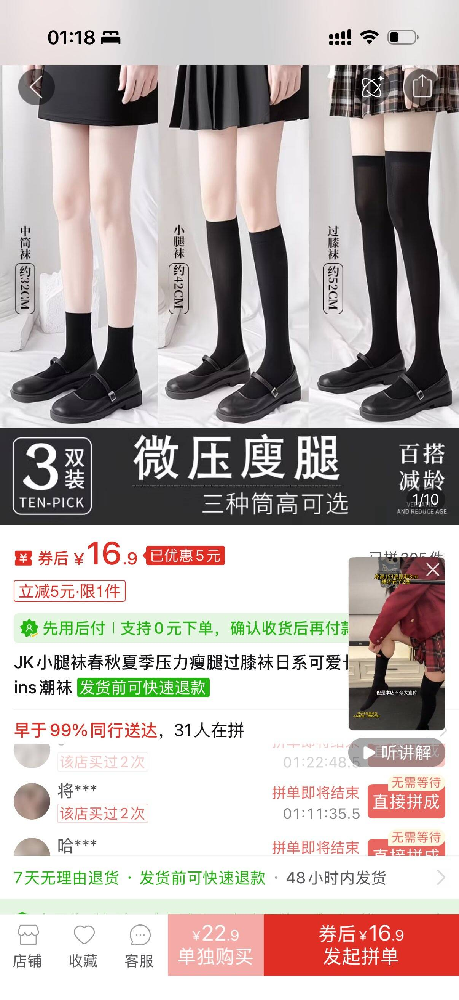

# 黑色微压小腿袜/过膝袜

> 这是社区成员的个人购买和穿着体验，不是广告、医学建议或效果保证。

## 商品页面截图（必填）

用户可根据截图中的商品标题、款式和平台信息自行搜索；截图中的价格与库存可能已经变化。

## 怎么消费或使用（必填）

本人实际购买并穿着过图示黑色袜款。页面展示了中筒袜、小腿袜和过膝袜三种长度，适合搭配短裙、百褶裙或水手服。购买前应按自己的腿围和袜筒长度选择尺码，首次穿着先短时间试穿。

## 推荐理由（必填）

如果腿部肌肉较明显或小腿线条偏粗，对本人而言，针织/毛料质感的黑色长筒袜或小腿袜比过薄的丝袜更容易弱化腿部线条，和深色裙装也更协调。黑色不透明或较厚的材质通常比白色、过薄的丝袜更低调；这是个人穿搭经验，不保证适合所有腿型和肤色。

## 地区与价格

- 购买渠道：截图所示电商平台
- 截图显示券后价：16.9 元
- 截图显示单独购买价：22.9 元
- 实际价格可能因优惠、尺码和运费变化，购买前请重新确认

## 缺点与不适合谁（必填）

微压袜的压力和袜筒长度因款式而异，过紧可能造成勒痕或活动不适；过膝款也可能在行走时下滑。需要长时间站立、运动或对紧绷感敏感时，应优先选择普通压力、合适尺码的款式。白色或浅色丝袜并非不能穿，只是可能更明显地呈现腿部轮廓。

## 安全、材质与清洁

首次穿着先检查袜口是否过紧，出现麻木、刺痛、明显肿胀、皮肤发紫或持续勒痕时应立即脱下。按洗标清洗，避免高温烘干和尖锐物勾挂；不要把普通“微压”商品当作医疗压力袜使用。

## 商业关系（必填）

本人自费购买，与卖家、制造商或店面无商业关系。
